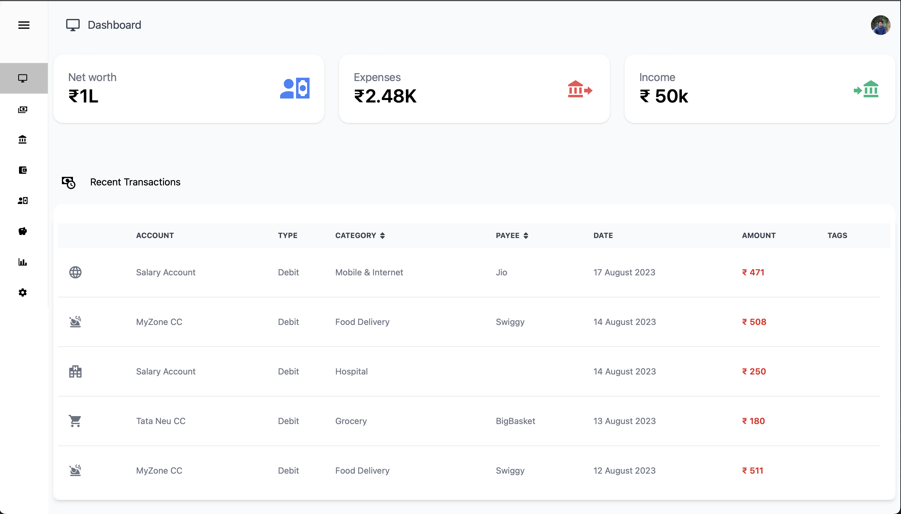
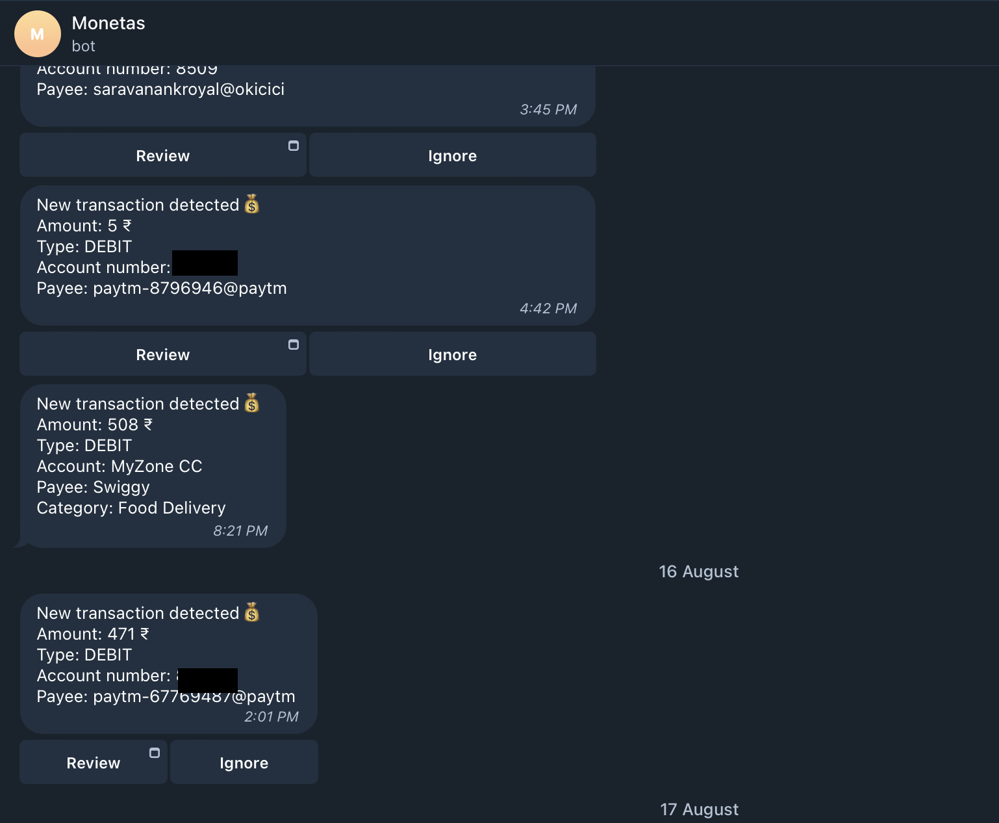

# Monetas

[](https://github.com/athulp01/monetas/actions/workflows/ci.yml)
[](https://github.com/athulp01/monetas/actions/workflows/migrateDb.yml)



# Demo

URL: https://monetas-athulp01.vercel.app
username: demo+clerk_test@monetas.github
password: monetas1234

# Features
* Automatically detects transactions in realtime by parsing emails.
   * List of supported banks and wallets - 
     1. HDFC accounts
     2. HDFC credit cards
     3. ICICI credit cards
     4. Axis credit cards
     5. Amazon pay wallet
* Supports importing of transactions from bank statements.
  * List of supported banks
    1. HDFC account statement - CSV format
    2. HDFC credit card statement - PDF format
* Stock and mutual fund portfolio tracking.
* Budgeting
* Analytics

# Installation
## Self Hosting
1. Edit docker-compose.yml to fill all missing env vars. Refer [here](#environment-variables) for more info.
2. Run `docker-compose up -d --build`
3. Navigate to http://localhost:3000

## Vercel
Vercel provides free hosting and postgres db with 500MB storage under their hobby plan.

1. Signup for [Vercel](https://vercel.com/home)
2. Create a free postgres database by following these [instructions](https://vercel.com/docs/storage/vercel-postgres/quickstart#create-a-postgres-database). 
3. Navigate to the created database. Copy the value of `POSTGRES_URL_NON_POOLING`, which is available under .env.local tab under quickstart section.
4. Run the below command from the repo root.
```bash
pnpm install
DIRECT_URL=<POSTGRES_URL_NON_POOLING> DATABASE_URL=$DIRECT_URL pnpm db:migrate
DIRECT_URL=<POSTGRES_URL_NON_POOLING> DATABASE_URL=$DIRECT_URL pnpm db:seed
```
5. Setup auth by following this [section](#auth-setup)
6. Setup integrations by following this [section](#integrations-setup)
7. Click the below button which will take you through the rest of process.

[](https://vercel.com/new/clone?repository-url=https%3A%2F%2Fgithub.com%2Fathulp01%2Fmonetas&project-name=monetas&repository-name=monetas&demo-title=Monetas&demo-url=https%3A%2F%2Fmonetas.vercel.app&integration-ids=oac_7uYNbc9CdDAZmNqbt3LEkO3a)
8. Integrations are disabled by default. If you want to enable them, follow this [section](#integrations-setup) and then add the env vars to [vercel project](https://vercel.com/docs/projects/environment-variables).

## Other Cloud Provider
Monetas can be deployed to cloud like any other nextjs app. Refer the nextjs deployment instructions [here](https://nextjs.org/docs/pages/building-your-application/deploying#other-services).


# Auth setup
Monetas uses [Clerk](https://clerk.dev/) for authentication. Follow the below steps to setup auth.
1. Signup for [Clerk](https://clerk.dev/)
2. Follow the [quickstart](https://clerk.com/docs/authentication/set-up-your-application) guide to setup Clerk.

# Integrations setup
## Gmail
Monetas can automatically detect transactions in realtime by parsing emails. This feature is powered by Gmail API. Follow the below steps to setup this integration.
1. Obtain OAuth2 credentials for accesing Google APIs by following this [link](https://developers.google.com/identity/protocols/oauth). Redirect URL should be set to `BASE_URL/api/gmail/oauth/callback`
2. Set the value of `NEXT_PUBLIC_GMAIL_OAUTH_CLIENT_ID`, `NEXT_PUBLIC_GMAIL_OAUTH_SECRET` and `NEXT_PUBLIC_GMAIL_OAUTH_REDIRECT_URL` env vars to the values obtained in the previous step.
3. Enable Gmail push notifications by following this [guide](https://developers.google.com/gmail/api/guides/push). Set the value of `PUB_SUB_TOPIC_NAME` env var to the topic name which you have created.
5. After linking the domain, you can enable this integration by navigating to `Settings -> Integrations`.

## Telegram
Monetas can send the real-time transaction notifications(only works if gmail integration is in place) to telegram. Using the telegram bot interface, you can edit the transaction and then verify and add it to monetas.


1. Obtain bot token from [BotFather](https://core.telegram.org/bots#6-botfather)
2. Generate a secret token eg: `openssl rand -base64 32`
3. Run the below command to set the webhook.
```bash
TELEGRAM_API_KEY=<botToken> BASE_URL=<baseUrl> TELEGRAM_SECRET_TOKEN=<secretToken> ./scripts/setup-telegram.sh
```
4. Follow this [guide](https://core.telegram.org/widgets/login#linking-your-domain-to-the-bot) to link your domain to the bot. This is required for the telegram login widget to work.
5. Set the value of `TELEGRAM_API_KEY`, `TELEGRAM_SECRET_TOKEN` and `NEXT_PUBLIC_TELEGRAM_BOT_NAME` env vars to the values obtained from the previous steps.
5. After linking the domain, you can enable this integration by navigating to `Settings -> Integrations`.

# Environment variables
Certainly, here are expanded descriptions for each of the environment variables in Markdown format:

## Required
1. `DATABASE_URL`:
   The URL of the postgres database. Its recommended to use a connection pooler like pgBouncer since the db connection limit can get exhausted quickly in a serverless environment.

2. `DIRECT_URL`:
   The direct connection URL of the database(without pooler). This is used for performing migrations and seeding. (DATABASE_URL and DIRECT_URL can be same)

3. `BASE_URL`:
   The base URL of your application
4. `NEXT_PUBLIC_CLERK_PUBLISHABLE_KEY`, `CLERK_SECRET_KEY`: Follow this [section](#auth-setup)

## Optional

1. `NEXT_PUBLIC_GMAIL_OAUTH_CLIENT_ID`, `NEXT_PUBLIC_GMAIL_OAUTH_SECRET`, `PUB_SUB_TOPIC_NAME` and `NEXT_PUBLIC_GMAIL_OAUTH_REDIRECT_URL`: Follow this [section](#gmail).
2. `TELEGRAM_API_KEY`, `TELEGRAM_SECRET_TOKEN` and `NEXT_PUBLIC_TELEGRAM_BOT_NAME`: Follow this [section](#telegram).
